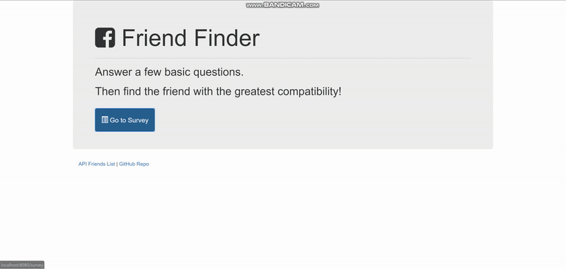
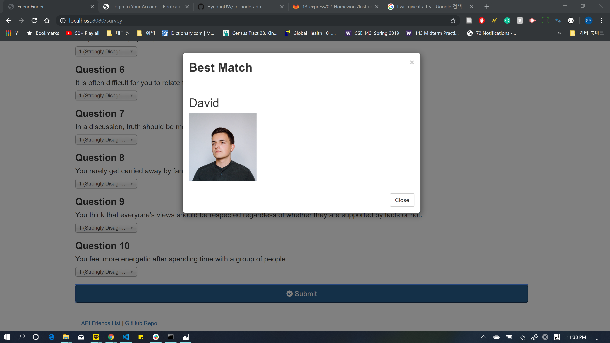

# FriendFinder

## Description

This is a compatibility-based "FriendFinder" application -- basically a dating app. This full-stack site will take in results from users' surveys, then compare their answers with those from other users. The app will then display the name and picture of the user with the best overall match.


## Use Example:

* General Use Case
### 

## Getting Started

<!-- ### Dependencies -->
<!-- ### Installing -->

### File Structure
```
FriendFinder
    - .gitignore
    - app
        - data
            - friends.js
        - public
            - home.html
            - survey.html
        - routing
            - apiRoutes.js
            - htmlRoutes.js
    - node_modules
    - package.json
    - server.js
```

### Functionality

* `server.js` 
    * Require the basic npm packages: `express` and `path`

* `htmlRoutes.js`
    * A `GET` Route to `/survey` which should display the survey page.
    * A `default`, `catch-all` route that leads to `home.html` which displays the home page.

* `apiRoutes.js`
    * A `GET` route with the url `/api/friends`. This will be used to display a JSON of all possible friends.
    * A `POST` routes `/api/friends`. This will be used to handle incoming survey results. This route will also be used to handle the compatibility logic.

* `friends.js`
    * Storing application data into `friends.js` in a following format...
        ```
        {
        "name":"Ahmed",
        "photo":"https://media.licdn.com/mpr/mpr/shrinknp_400_400/p/6/005/064/1bd/3435aa3.jpg",
        "scores":[
            5,
            1,
            4,
            4,
            5,
            1,
            2,
            5,
            4,
            1
            ]
        }
        ```    


### General Flow of Application
1. The survey has 10 questions. Each answer should be on a scale of 1 to 5 based on how much the user agrees or disagrees with a question.

2. Determining the user's most compatible friend
    * Convert each user's results into a simple array of numbers 
        * `ex`:   `[5, 1, 4, 4, 5, 1, 2, 5, 4, 1]`)
    * With that done, compare the difference between current user's scores against those from other users, question by question. Add up the differences to calculate the totalDifference.
        * Example:
            * `User 1`: [`5`, `1`, `4`, 4, 5, 1, 2, 5, 4, 1]
            * `User 2`: [`3`, `2`, `6`, 4, 5, 1, 2, 5, 4, 1]
            * `Diff  `: [`2`, `1`, `2`, 0, 0, 0, 0, 0, 0, 0] 
            * `Total Difference`: 2 + 1 + 2 = 5
    * The closest match will be the user with the least amount of difference.

3. Once this application found the current user's most compatible friend, it will display the result as a modal pop-up. 
    * The modal should display both the name and picture of the closest match.
    

## Deployed Page:

* [Heroku Link](https://evening-beach-73153.herokuapp.com/)
<!-- * [Github Link](https://hyeonguw.github.io/FriendFinder/) -->


<!-- ## Enhancements -->

    
## Authors

* Hyeong Suk Kim - whddkf2004@gmail.com

## Technologies used in the App
* npm package (`express`, `path`)
    * Express npm package is used to handle routing.
* JavaScript
* html

## License

* Photo by Alex Suprun on Unsplash

## Version History

* 0.1  Initial Release